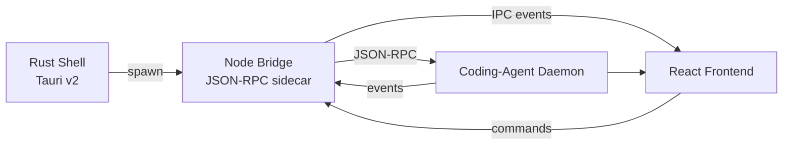

<div align="center">


# Sophos

**A Windows-native coding agent. Own your intelligence.**

Sophos brings [Prime Intellect's](https://www.primeintellect.ai/) open-source
coding agent to Windows as a polished desktop app — Tauri v2 (Rust) shell,
Node bridge sidecar, and a React frontend styled after the Prime Intellect
design language: Geist typography, terminal-green accents, sharp corners,
near-black surfaces.

[](https://v2.tauri.app/)
[](https://react.dev/)
[](https://www.typescriptlang.org/)
[](LICENSE)
[](https://gitlab.com/caylebalvarez-james/sophos/-/releases)

**Credits:** This is a Windows port of [PrimeIntellect-ai/prime-agent](https://github.com/PrimeIntellect-ai/prime-agent). All credit for the agent runtime, daemon, and bridge belongs to the Prime Intellect team.

</div>

> **⚠️ Beta Notice:** All Sophos versions before v1.0 are beta releases. Features may change, and there may be bugs. Use in production at your own risk.

---

## Screenshots

<table>
  <tr>
    <td width="50%"></td>
    <td width="50%"></td>
  </tr>
  <tr>
    <td width="50%"></td>
    <td width="50%"></td>
  </tr>
  <tr>
    <td width="50%"></td>
    <td width="50%"></td>
  </tr>
</table>

---

## Quick start — download & run

| Step | What |
|---|---|
| **1. Download** | Grab `Sophos_0.5.0_x64-setup.exe` from the [Releases](https://gitlab.com/caylebalvarez-james/sophos/-/releases) page. |
| **2. Install** | Run the `.exe`. Sophos installs to `~\AppData\Local\Sophos`. No admin required. |
| **3. Launch** | Open **Sophos**. The bundled Node runtime + daemon + bridge start automatically. |
| **4. Add a provider** | Go to **Settings → Providers** and add an LLM provider (API key or local model). |
| **5. Chat** | Start a new session and begin. |

> **Zero manual dependencies.** The installer bundles the portable Node
> runtime, the daemon `dist/`, the bridge `dist/`, and the shared
> `node_modules/` — everything the app needs to run.

---

## What's inside

```
Sophos/
├── src-tauri/          # Rust shell — launches + supervises the daemon
├── src/                # React frontend (TypeScript + Vite + framer-motion)
│   ├── shell/          # SystemBar, Sidebar, app frame
│   ├── design/         # Token system, core primitives, motion
│   ├── features/       # Chat, Sessions, Agents, Inbox, Settings, Engine
│   └── views/          # Routed view wrappers
├── bridge/             # Node JSON-RPC sidecar (daemon ↔ frontend)
├── scripts/bundle.mjs  # Stages the runtime layout under resources/
├── resources/          # Bundled runtime: node/, daemon/, bridge/, node_modules/
└── verify/             # E2E harness (bundle + layout + daemon round-trip)
```

### Architecture



A Tauri v2 (Rust) shell spawns and supervises the Prime Agent coding-agent
daemon, fronts it with a Node bridge sidecar over JSON-RPC, and renders a
React frontend. The daemon does the actual AI work (tool calls, file edits,
shell commands); the bridge translates between the daemon's event stream and
the frontend's IPC; the frontend is the user-facing terminal-minimal UI.

---

## Design system

Sophos matches the [Prime Intellect](https://www.primeintellect.ai/) website
aesthetic — the visual language is derived directly from the live site:

| Token | Value | Role |
|---|---|---|
| Background | `#0e0e0e` | Near-black surfaces |
| Foreground | `#f4f4f4` | Off-white text (opacity-based hierarchy: 0.3 → 0.9) |
| Border | `#2a2a2a` | Hairline dividers — the primary visual separator |
| Accent | `#85ed75` | Terminal green — the sole color signal |
| Radius | `0px` | Sharp corners everywhere (circular dots excepted) |
| Display type | **Geist** | Vercel's type family |
| Mono type | **Geist Mono** | Terminal, code, commands |

**The Σ mark** — the Sophos icon is a sharp geometric **Σ** (sigma — the sum
of knowledge, nodding to the Greek root of "Sophos": wisdom/intellect).
Off-white `#f4f4f4` with a terminal-green `#85ed75` accent on a near-black
field. Flat, minimal, legible from 16px to 512px. Source: `public/sophos-icon.svg`.

---

## Code Mode — the typed tool SDK

Code Mode (selectable from the header profile chip, next to Standard /
Minimal / Creator) exposes the agent's tools through a **typed TypeScript
SDK**: the agent writes ONE program that calls many tools in a single step
instead of dozens of separate tool round-trips — exactly what DeepSeek
Harness's Code mode does.

- **Deterministic SDK renderer** — turns a live tool registry into typed
  TypeScript stubs: lexicographic tool order, byte-identical output for an
  unchanged tool set, and unsupported schemas degrade to a permissive
  contract instead of throwing. Only erasable TypeScript is emitted, so
  stripping types yields valid JavaScript.
- **Live tool registry** — built from the same sources the rest of the app
  already uses: built-in tools, extension tools (`getExtensions`), MCP tools
  (enabled servers in Settings → Advanced, probed via `testMcpServer`), and
  skills (`getRuntimeInfo`).
- **run_code program view** — a right-side drawer decomposes each program
  into its individual tool-call cards (the same cards the chat renders) and
  records the program + every call in the Trajectory log, so runs are
  searchable, resumable, and forkable like any session.

> **Known limitation:** `run_code` is **demo-mode only** for now. The daemon
> contract has no seam for a sandboxed TypeScript runtime, so programs are
> simulated and every output is clearly labeled — a real runtime needs a
> daemon/bridge contract change (see CHANGELOG).

---

## Profile Studio — build your own agent

The Profile Studio (opens from the header profile chip → **Profile Studio —
build your own**) is the DeepSeek Harness **Creator mode made visual**: inspect
the live runtime, compose capabilities, and test in memory — no restart, no
Save required to see the effect.

- **Inspect the live runtime** — the editor composes from the same live tool
  registry the Code Mode SDK renders (built-in tools + extension/MCP tools +
  discovered skills, with per-category counts). A source that is absent — no
  MCP servers configured, no extensions, the runtime not reporting skills —
  degrades honestly: the group renders its count and a plain note instead of
  pretending.
- **Compose** — name, tagline, description, working style (one chip per
  line), base mode (Standard / Minimal / Creator / Code), tool toggles per
  category, skill toggles, and a safety posture (auto-approve safe tools vs.
  a confirm list). A live composition summary updates with every toggle.
- **Test in memory (hot reload)** — every edit applies to the running app
  immediately: the header chip, the composer hint, and (in demo mode) the
  simulated responses all follow the draft. **Save** persists to settings and
  selects a new profile; **Discard** drops the draft; **Delete** removes the
  profile and falls back to Standard defaults if it was active. A malformed
  or empty profile (no name / no tools) degrades to Standard defaults
  instead of crashing.
- **Picker integration** — custom profiles live in a **Custom** section
  beside the five built-ins (Gauntlet / Standard / Minimal / Creator / Code),
  each with Edit / Delete actions; the selection and the store survive
  restarts.

> **Known limitation:** a custom profile's instructions are an **additive
> UI-layer hint, exactly like the built-in profiles** — the daemon contract
> has no seam to apply the composed system prompt / tool set / safety posture
> to live sessions (the bridge forwards only `streamingBehavior` and
> `queueIfBusy` from prompt options). Custom profiles therefore visibly drive
> the header chip, composer hint, composition summary, and demo responses,
> and persist in settings — but wiring them into the live daemon needs a
> bridge/daemon contract change (a future release). See CHANGELOG for the
> full limitation and the `custom-protocol` build note.

---

## Build from source

### Prerequisites

| Tool | Why | Version |
|---|---|---|
| **Node.js** | build frontend + bridge | 22+ |
| **Rust** | compile the Tauri shell | 1.90+ |
| **Tauri CLI** | `npm run tauri` | 2.x |
| **NSIS** | build the `.exe` installer | see [Troubleshooting](#troubleshooting) |
| **Git for Windows** | provides `bash` for the daemon | any recent |

### Build steps

```bash
# 1. Stage the runtime layout (daemon dist, bridge dist, node, node_modules)
#    + build the frontend/bridge:
node scripts/bundle.mjs

# 2. Build the native installer:
npm run tauri build
# → src-tauri/target/release/bundle/nsis/Sophos_0.5.0_x64-setup.exe
#   (native binary at src-tauri/target/release/prime-agent-windows.exe)
```

The `bundle.mjs` manifest is written to `resources/.bundle-manifest.json`.
Flags: `--no-frontend`, `--no-bridge`, `--no-node-modules`, `--layout-check-only`, `--help`.

### Environment variables

| Var | Purpose | Default |
|---|---|---|
| `PRIME_AGENT_REF` | daemon source checkout (read-only) | `…\workspace\prime-agent-ref` |
| `PRIME_NODE_MODULES` | portable node_modules source | installed app's `node_modules/` |
| `PRIME_NODE_RUNTIME` | portable Node runtime source | installed app's `node/` |
| `PRIME_DAEMON_TCP` | `1` = force TCP transport (if named pipes are blocked) | unset |

### Verify

```bash
node scripts/bundle.mjs
node verify/e2e.mjs          # bundle + layout + daemon TCP round-trip
```

Reports: `verify/e2e-report.json`, `verify/e2e-evidence.txt`.

---

## Layout of the bundled app

At runtime the Tauri resource dir contains (this is what
`src-tauri/src/settings.rs::resolve_runtime_paths()` expects):

```
<resource dir>/
  node/node.exe                 # portable Node 22+ runtime
  daemon/dist/cli.js            # coding-agent --mode daemon entry
  daemon/package.json
  bridge/dist/bridge/src/index.js  # JSON-RPC sidecar entry
  node_modules/                 # shared dependency tree
```

| Staging (`resources/`) | Runtime resource dir |
|---|---|
| `resources/daemon/dist` | `daemon/dist` |
| `resources/daemon/package.json` | `daemon/package.json` |
| `resources/bridge/dist` | `bridge/dist` |
| `resources/node_modules` | `node_modules` |
| `resources/node/node-v24.18.0-win-x64` | `node` |

---

## Named-pipe wedge & TCP fallback

On some Windows machines `CreateNamedPipeW` returns `ERROR_INVALID_NAME` for
every caller, while TCP loopback keeps working.

| Mechanism | Effect |
|---|---|
| `PRIME_DAEMON_TCP=1` | daemon + client use `tcp://127.0.0.1:48100` |
| `--daemon-socket tcp://127.0.0.1:48130` | explicit TCP endpoint |

The E2E harness tries named-pipe first and falls back to TCP automatically.

---

## Troubleshooting

**`npm run tauri build` fails at `makensis` (MAX_PATH).**

The NSIS `makensis` step may abort on a deeply-nested `@mistralai` resource
path exceeding Windows `MAX_PATH` (260 chars). This is **non-blocking** — the
native binary, frontend, and bundle are all built; only the final `.exe`
wrapper fails.

> **Verified 2026-08-08:** the build succeeded end-to-end from this worktree
> (`src-tauri/target/release/bundle/nsis/Sophos_0.5.0_x64-setup.exe`, ~93 MB).
> The blocker only triggers when the staged path pushes the deepest
> `@mistralai` file past 260 chars — the current `prime-agent-windows`
> worktree path keeps it at ~221 chars. If you ever hit it, shorten the
> worktree path or apply a workaround below.

Workarounds:

1. Strip `.d.ts`/`.d.ts.map`/`.map` files from `resources/node_modules/`
   before bundling (runtime-irrelevant — TypeScript types are dev-only).
2. Enable Windows long-paths (Group Policy → Enable Win32 long paths) and
   rebuild with NSIS 3.x long-path support.
3. Stage the bundle closer to the repo root (shorter path → under 260 chars).

**Daemon: `DaemonSupervisorAlreadyRunningError`.**

A stale supervisor registry from a crashed daemon lives under
`~/.prime/agent/daemon-workers/`. Run `node <cli> daemon ps --cleanup` and
restart.

---

## License

MIT — same license as the upstream [PrimeIntellect-ai/prime-agent](https://github.com/PrimeIntellect-ai/prime-agent).

<div align="center">

*Brought to you by [Cayleb](https://gitlab.com/caylebalvarez-james). Built on the open superintelligence stack.*

</div>
