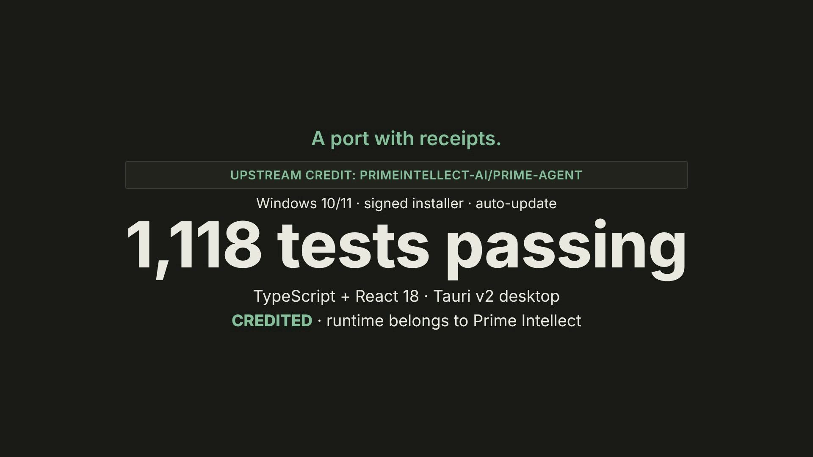
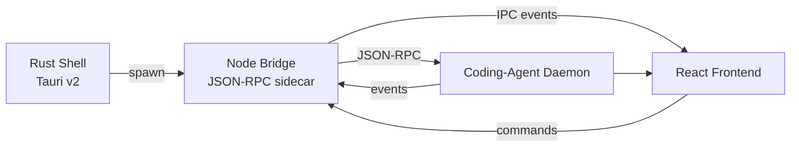

<div align="center">


# Sophos

**A Windows-native coding agent. Own your intelligence.**

I’m building Sophos to bring [Prime Intellect’s](https://www.primeintellect.ai/)
open-source Prime Agent coding agent to Windows as a desktop app. I work on the
Tauri v2/Rust shell, React UI, packaging, and reliability layers around the
upstream runtime. Prime Intellect created the agent runtime, daemon, and bridge;
Sophos pins their public v0.7.0 source and includes the upstream MIT notice.

**Windows-only.** I’m building Sophos for Windows 10/11 developers who want
Prime Agent in a desktop app instead of a terminal. The GitLab Releases page
currently lists v0.6.0 as its latest tagged release; the signed updater feed
separately announces a v0.7.2 package. Those are different publication
records. See [Quick start](#quick-start--download--run) for both links and
the verification boundary.

[](https://v2.tauri.app/)
[](https://react.dev/)
[](https://www.typescriptlang.org/)
[](LICENSE)
[](https://gitlab.com/caylebalvarez-james/sophos/-/releases)

**Upstream credit:** [PrimeIntellect-ai/prime-agent](https://github.com/PrimeIntellect-ai/prime-agent) provides the agent runtime, daemon, and bridge. Sophos packages that MIT-licensed upstream; the desktop shell and UI are this project’s work.

</div>

> **⚠️ Beta Notice:** All Sophos versions before v1.0 are beta releases. Features may change, and there may be bugs. Use in production at your own risk.

---

## Launch video

[](brag-output/brag.mp4)

*20-second launch video rendered with `/brag` + Hyperframes — click the still to watch.*

## Screenshots

<table>
  <tr>
    <td width="50%"></td>
    <td width="50%"></td>
  </tr>
  <tr>
    <td width="50%"></td>
    <td width="50%"></td>
  </tr>
  <tr>
    <td width="50%"></td>
    <td width="50%"></td>
  </tr>
</table>

---

## Quick start — download & run

| Step | What |
|---|---|
| **1. Download** | Choose the latest tagged installer from [GitLab Releases](https://gitlab.com/caylebalvarez-james/sophos/-/releases) (currently v0.6.0), or the separate [v0.7.2 signed updater-feed package](https://gitlab.com/api/v4/projects/85429532/packages/generic/sophos/0.7.2/Sophos_0.7.2_x64-setup.exe). The feed package is not a tagged release and may not match this source tree. |
| **2. Install** | Run the `.exe`. The installer is configured for a per-user install; see the current Windows workflow for fresh-install verification status. |
| **3. Launch** | Open **Sophos**. The bundled Node runtime + daemon + bridge start automatically. |
| **4. Add a provider** | Go to **Settings → Providers** and add an LLM provider (API key or local model). |
| **5. Chat** | Start a new session and begin. |

> **Bundled runtime.** The Windows package is built to include the portable
> Node runtime, daemon, bridge, and shared `node_modules/`. The current
> candidate’s installer/UI acceptance is tracked separately from Linux checks.

---

## Verification status

I keep Linux source checks separate from Windows installer and UI acceptance.
The latest local run on the integrated candidate used Linux and Node v26.7.0:

| Area | Result | Scope |
|---|---|---|
| `npm run test` | Pass: 1,126 Vitest tests and 36 Node checks | Local Linux run; no Windows UI implied |
| `npm run build` | Pass | TypeScript and Vite build on Linux |
| Staged daemon/bridge E2E | Pass: 50/50 checks | Real pinned Prime Agent v0.7.0 runtime over a Unix socket; recovery uses an isolated loopback mock provider, not live inference |
| Public updater feed | Pass: signature and tamper checks | Downloaded the v0.7.2 package (98,197,077 bytes; SHA-256 `04ee6d7e2bb7c0d6651c5e2de39fa01d9654602c4ddba8dd5777b92c06816584`); not installed on this Linux host |
| CUA helper tests | Pass: 61/61 | Local driver/helper tests; not native desktop acceptance |
| Windows installer, fresh public-package install, and native CUA | Pending on the integrated candidate | GitHub Actions is configured to build/inspect the MSI, install the exact signed feed package, run a fresh-profile non-demo smoke, and test the source-built app through UIA. Wait for the exact-head result before claiming acceptance. |

The earlier PR #11 head had real Windows CUA and PR-event E2E failures; its
locally corrected integration candidate has not yet replaced those results
with a fresh hosted Windows run. Linux checks prove source/runtime behavior on
this host only; they do not validate WebView2, installer execution, or native
UI Automation.

---

## What's inside

```
Sophos/
├── src-tauri/          # Rust shell — launches + supervises the daemon
├── src/                # React frontend (TypeScript + Vite + framer-motion)
│   ├── shell/          # SystemBar, Sidebar, app frame
│   ├── design/         # Token system, core primitives, motion
│   ├── features/       # Chat, Sessions, Agents, Inbox, Settings, Engine
│   └── views/          # Routed view wrappers
├── bridge/             # Node JSON-RPC sidecar (daemon ↔ frontend)
├── scripts/bundle.mjs  # Stages the runtime layout under resources/
├── resources/          # Bundled runtime: node/, daemon/, bridge/, node_modules/
└── verify/             # E2E harness (bundle + layout + daemon round-trip)
```

### Architecture


```mermaid
flowchart LR
    A[Rust Shell<br/>Tauri v2] -->|spawn| B[Node Bridge<br/>JSON-RPC sidecar]
    B -->|JSON-RPC| C[Coding-Agent Daemon]
    C -->|events| B
    B -->|IPC events| D[React Frontend]
    D -->|commands| B
    C --> D
```

A Tauri v2 (Rust) shell spawns and supervises the Prime Agent coding-agent
daemon, fronts it with a Node bridge sidecar over JSON-RPC, and renders a
React frontend. The daemon does the actual AI work (tool calls, file edits,
shell commands); the bridge translates between the daemon's event stream and
the frontend's IPC; the frontend is the user-facing terminal-minimal UI.

---

## Design system

Sophos matches the [Prime Intellect](https://www.primeintellect.ai/) website
aesthetic — the visual language is derived directly from the live site:

| Token | Value | Role |
|---|---|---|
| Background | `#0e0e0e` | Near-black surfaces |
| Foreground | `#f4f4f4` | Off-white text (opacity-based hierarchy: 0.3 → 0.9) |
| Border | `#2a2a2a` | Hairline dividers — the primary visual separator |
| Accent | `#85ed75` | Terminal green — the sole color signal |
| Radius | `0px` | Sharp corners everywhere (circular dots excepted) |
| Display type | **Geist** | Vercel's type family |
| Mono type | **Geist Mono** | Terminal, code, commands |

**The Σ mark** — the Sophos icon is a sharp geometric **Σ** (sigma — the sum
of knowledge, nodding to the Greek root of "Sophos": wisdom/intellect).
Off-white `#f4f4f4` with a terminal-green `#85ed75` accent on a near-black
field. Flat, minimal, legible from 16px to 512px. Source: `public/sophos-icon.svg`.

---

## Code Mode — the typed tool SDK

Code Mode (selectable from the header profile chip, next to Standard /
Minimal / Creator) exposes the agent's tools through a **typed TypeScript
SDK**: the agent writes ONE program that calls many tools in a single step
instead of dozens of separate tool round-trips — exactly what DeepSeek
Harness's Code mode does.

- **Deterministic SDK renderer** — turns a live tool registry into typed
  TypeScript stubs: lexicographic tool order, byte-identical output for an
  unchanged tool set, and unsupported schemas degrade to a permissive
  contract instead of throwing. Only erasable TypeScript is emitted, so
  stripping types yields valid JavaScript.
- **Live tool registry** — built from the same sources the rest of the app
  already uses: built-in tools, extension tools (`getExtensions`), MCP tools
  (enabled servers in Settings → Advanced, probed via `testMcpServer`), and
  skills (`getRuntimeInfo`).
- **run_code program view** — a right-side drawer decomposes each program
  into its individual tool-call cards (the same cards the chat renders) and
  records the program + every call in the Trajectory log, so runs are
  searchable, resumable, and forkable like any session.

> **Known limitation:** `run_code` is **demo-mode only** for now. The daemon
> contract has no seam for a sandboxed TypeScript runtime, so programs are
> simulated and every output is clearly labeled — a real runtime needs a
> daemon/bridge contract change (see CHANGELOG).

---

## Profile Studio — build your own agent

The Profile Studio (opens from the header profile chip → **Profile Studio —
build your own**) is the DeepSeek Harness **Creator mode made visual**: inspect
the live runtime, compose capabilities, and test in memory — no restart, no
Save required to see the effect.

- **Inspect the live runtime** — the editor composes from the same live tool
  registry the Code Mode SDK renders (built-in tools + extension/MCP tools +
  discovered skills, with per-category counts). A source that is absent — no
  MCP servers configured, no extensions, the runtime not reporting skills —
  degrades honestly: the group renders its count and a plain note instead of
  pretending.
- **Compose** — name, tagline, description, working style (one chip per
  line), base mode (Standard / Minimal / Creator / Code), tool toggles per
  category, skill toggles, and a safety posture (auto-approve safe tools vs.
  a confirm list). A live composition summary updates with every toggle.
- **Test in memory (hot reload)** — every edit applies to the running app
  immediately: the header chip, the composer hint, and (in demo mode) the
  simulated responses all follow the draft. **Save** persists to settings and
  selects a new profile; **Discard** drops the draft; **Delete** removes the
  profile and falls back to Standard defaults if it was active. A malformed
  or empty profile (no name / no tools) degrades to Standard defaults
  instead of crashing.
- **Picker integration** — custom profiles live in a **Custom** section
  beside the five built-ins (Gauntlet / Standard / Minimal / Creator / Code),
  each with Edit / Export / Delete actions; the selection and the store survive
  restarts.
- **Portability (export / import)** — save any custom profile to a
  **human-readable JSON file** (`*.sophos-profile.json`, a pretty-printed
  `sophos-custom-profile` envelope) and load it back or share it: **Export**
  from the studio footer (the live draft, even before Save) or a profile's
  card in the picker writes through the **native save dialog**; **Import** via
  the **native open dialog** re-parses the file through the same guarded
  store sanitizer settings use, so an export → import round-trip reproduces
  the identical composition. Parsing never crashes — malformed JSON, a
  foreign file, a future version, or a broken field shape each produce a
  clear error — and a name collision is **never silently overwritten**: the
  incoming profile becomes a unique copy (`"Name (copy)"`) with a visible
  notice saying nothing was overwritten.

> **Known limitation:** a custom profile's instructions are an **additive
> UI-layer hint, exactly like the built-in profiles** — the daemon contract
> has no seam to apply the composed system prompt / tool set / safety posture
> to live sessions (the bridge forwards only `streamingBehavior` and
> `queueIfBusy` from prompt options). Custom profiles therefore visibly drive
> the header chip, composer hint, composition summary, and demo responses,
> and persist in settings — but wiring them into the live daemon needs a
> bridge/daemon contract change (a future release). See CHANGELOG for the
> full limitation and the `custom-protocol` build note.

---

## Build from source

### Prerequisites

| Tool | Why | Version |
|---|---|---|
| **Node.js** | build frontend + bridge | 22+ |
| **Rust** | compile the Tauri shell | 1.90+ |
| **Tauri CLI** | `npm run tauri` | 2.x |
| **Tauri Windows prerequisites** | build a native package | [Tauri v2 requirements](https://v2.tauri.app/start/prerequisites/) |
| **Git for Windows** | provides `bash` for the daemon | any recent |

### Build steps

```bash
# Start at the repository root. This command installs the frontend dependencies,
# clones the exact Prime Agent source pin into ignored .deps/ if needed, installs
# that source's locked dependencies with normal lifecycle scripts, compiles the
# upstream daemon + bridge, stages verified runtime inputs, and builds the UI.
npm ci
node scripts/bundle.mjs

# Run the real daemon/bridge offline protocol smoke test with isolated HOME.
# On Windows it uses the verified bundled node.exe; on Linux it uses the host
# Node executable and Unix-domain socket. Recovery uses an isolated loopback
# mock provider so the test does not make live model requests.
node verify/e2e.mjs

# Guarded Windows MSI build (requires Windows x64 + Rust/Tauri prerequisites).
node scripts/build-windows-installer.mjs
node scripts/verify-tauri-package.mjs
# The verifier extracts the MSI and checks the bundled upstream MIT notice.
```

The first `bundle.mjs` run needs network access to clone the pinned public
Prime Agent source, install locked npm dependencies, and obtain the hash-verified
official Node runtime. It does not call a model/provider API and needs no API
keys. Prime Agent publishes its source in a monorepo rather than publishing the
`@earendil-works/pi-*` package tarballs to npm; run the root bundler before
installing/building `bridge/` on its own. The bundle command also validates an
operator-supplied `PRIME_AGENT_REF` against the exact origin, tag commit, version,
MIT license, and clean-worktree state before using it.

The `bundle.mjs` manifest is written to `resources/.bundle-manifest.json` and records the native dependency build host, architecture, Windows target, build mode, and release eligibility. Default Windows release staging is accepted only on a real Windows x64 host. Linux/macOS may use `--diagnostic` for source/Unix-socket diagnostics; that provenance is permanently ineligible for the Windows installer, and `scripts/build-windows-installer.mjs` fails closed unless it validates a Windows-release manifest.

Flags: `--no-frontend`, `--no-bridge`, `--no-node-modules`, `--layout-check-only`, `--diagnostic`, `--help`.

The Windows CI workflow is configured to load ZeroMQ, Koffi, and the Windows clipboard addon using the bundled Windows Node binary, build the MSI through the guarded release entrypoint, then administratively extract the MSI and compare its `daemon/LICENSE` beside the installed `prime-agent-windows.exe` byte-for-byte with the staged upstream `resources/daemon/LICENSE`. These checks require a successful Windows runner; Linux results do not substitute for native or installer evidence.

### Environment variables

| Var | Purpose | Default |
|---|---|---|
| `PRIME_AGENT_REF` | optional Prime Agent source checkout | `.deps/prime-agent (pinned v0.7.0, MIT)` |
| `PRIME_NODE_RUNTIME` | verified `node.exe` override | official Node v24.18.0 win-x64 download (SHA-256 checked) |
| `PRIME_DAEMON_TCP` | Unsupported by pinned Prime Agent v0.7.0; Sophos does not set it | not set |
| `daemonTcp` (`settings.json`) | Legacy persisted field ignored by the Rust shell; it cannot enable TCP | ignored |

### Verify

```bash
node scripts/bundle.mjs
node verify/e2e.mjs          # staged bundle + real bridge/daemon JSON-RPC + recovery
```

Reports: `verify/e2e-report.json`, `verify/e2e-evidence.txt`.

---

## Layout of the bundled app

At runtime the Tauri resource dir contains (this is what
`src-tauri/src/settings.rs::resolve_runtime_paths()` expects):

```
<resource dir>/
  node/node-v24.18.0-win-x64/node.exe  # official runtime, SHA-256 pinned
  daemon/dist/cli.js            # coding-agent --mode daemon entry
  daemon/package.json
  daemon/LICENSE               # pinned upstream Prime Agent MIT notice
  bridge/dist/bridge/src/index.js  # JSON-RPC sidecar entry
  node_modules/                 # shared dependency tree
```

| Staging (`resources/`) | Runtime resource dir |
|---|---|
| `resources/daemon/dist` | `daemon/dist` |
| `resources/daemon/package.json` | `daemon/package.json` |
| `resources/daemon/LICENSE` | `daemon/LICENSE` |
| `resources/bridge/dist` | `bridge/dist` |
| `resources/node_modules` | `node_modules` |
| `resources/node/node-v24.18.0-win-x64` | `node` |

---

## TCP fallback compatibility blocker

The previously documented TCP fallback is not supported by the selected public
Prime Agent dependency. At commit `be9e2fa0714e7cd1c6bd9bdb1b554d2cc6550387`,
`DaemonSupervisor.listen()` calls Node's `net.Server.listen(this.socketPath)`
with no `tcp://` parsing or `PRIME_DAEMON_TCP` handling. Supplying
`--daemon-socket tcp://127.0.0.1:<port>` therefore does not create a TCP listener.
The Settings control is disabled and explicitly labels TCP unsupported; a legacy
`daemonTcp: true` value in `settings.json` is ignored by Rust. Both daemon and
bridge launch using the pinned runtime's supported default local socket.
The Linux verifier exercises the real daemon and bridge over a Unix-domain
socket; Windows named-pipe and native installer behavior require a Windows run.
Do not rely on TCP until a compatible upstream release or a reviewed transport
implementation is tested end-to-end.

---

## Troubleshooting

The guarded installer entrypoint builds an MSI only from a verified Windows-x64
release bundle and refuses Linux diagnostic provenance. Run
`node scripts/build-windows-installer.mjs`, then
`node scripts/verify-tauri-package.mjs` to inspect the package notice. A
successful MSI build and notice check do not prove installation; the GitHub
workflow separately installs the exact signed package announced by the public
updater feed and runs a fresh-profile app smoke. That public NSIS package is a
different artifact from the candidate MSI.

**Daemon: `DaemonSupervisorAlreadyRunningError`.**

A stale supervisor registry from a crashed daemon lives under
`~/.prime/agent/daemon-workers/`. Run `node <cli> daemon ps --cleanup` and
restart.

---

## License

MIT — same license as the upstream [PrimeIntellect-ai/prime-agent](https://github.com/PrimeIntellect-ai/prime-agent).

<div align="center">

*Brought to you by [Cayleb](https://gitlab.com/caylebalvarez-james). Built on the open superintelligence stack.*

</div>
